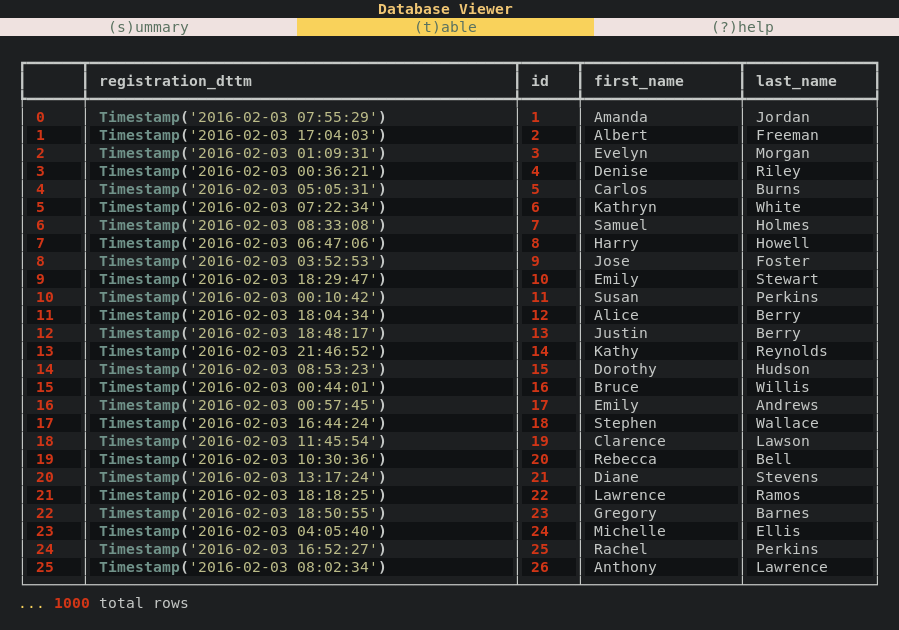
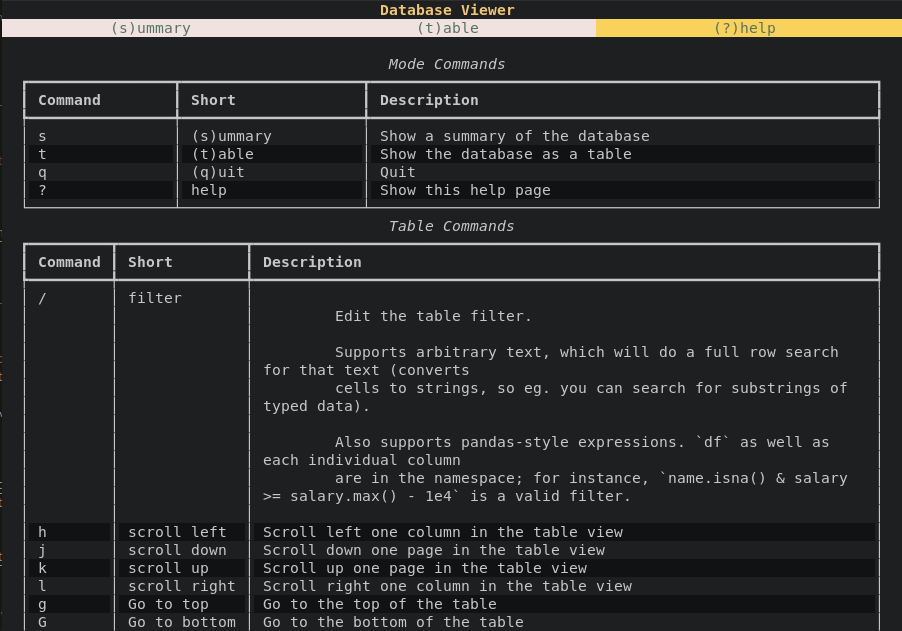
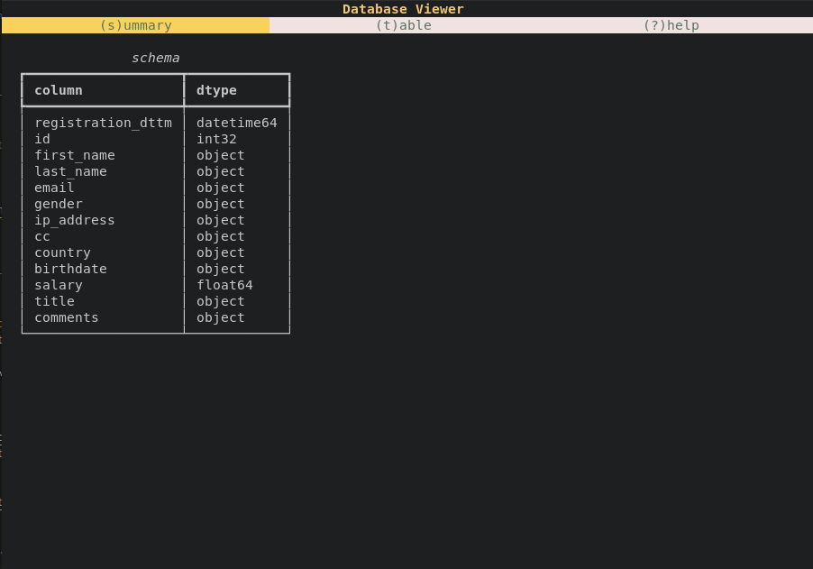
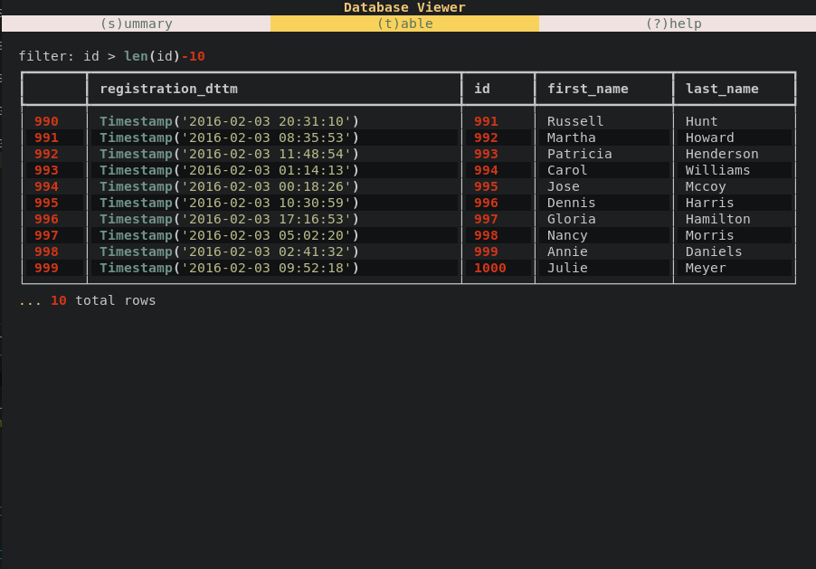

    
# Dataset Viewer

Dataset Viewer is a cross-platform tool for visually exploring Parquet files in the terminal.
## Demo

View the demo [on YouTube](https://youtu.be/X5bcZYpqKnA)!

```shell
# View the userdata1.parquet file with dataset viewer
$ dbv userdata1.parquet
```



View the available commands by pressing `?`



View a summary of the table by pressing `s`



Go back to the table view at any time by pressing `t` then show only the last 10 `id`s using the filter command `/`.



See the [usage](#usage) section below for more information about the available commands.

## Usage

```
Usage: dbv [OPTIONS] FILENAME

  View the parquet format file FILENAME as a table

Options:
  --help  Show this message and exit.
```

### Command Reference

#### View Commands

| Command | Short     | Description                    |
| ------- | --------- | ------------------------------ |
| s       | (s)ummary | Show a summary of the database |
| t       | (t)able   | Show the database as a table   |
| q       | (q)uit    | Quit                           |
| ?       | help      | Show this help page            |

#### Table Commands

These commands are only available in the table view.

| Command | Short        | Description                                                                                                                                           |
| ------- | ------------ | ----------------------------------------------------------------------------------------------------------------------------------------------------- |
| /       | filter       | Edit the table filter. Supports arbitrary text, which will do a full row search for that text (converts cells to strings, so eg. you can search for substrings of typed data). Also supports pandas-style expressions. `df` as well as each individual column are in the namespace; for instance, `name.isna() & salary >= salary.max() - 1e4` is a valid filter. |
| h       | scroll left  | Scroll left one column in the table view                                                                                                              |
| j       | scroll down  | Scroll down one page in the table view                                                                                                                |
| k       | scroll up    | Scroll up one page in the table view                                                                                                                  |
| l       | scroll right | Scroll right one column in the table view                                                                                                             |
| g       | Go to top    | Go to the top of the table                                                                                                                            |
| G       | Go to bottom | Go to the bottom of the table                                                                                                                         |
## Installation

This project requires `python` version 3.9. Replace `pip` with `pip3.9` below if `python` 3.9 is not your default version.

You can install Dataset Viewer with `pip`:

```shell
# From local clone
$ git clone https://github.com/doodletaco/dataset-viewer.git
$ pip install --user dataset-viewer

# Or directly from GitHub
$ pip install --user git+https://github.com/doodletaco/dataset-viewer.git
```
    
## Contributing

Contributions are always welcome!

This project uses [Pipenv](https://pipenv.pypa.io/en/latest/) for package
management and [pre-commit](https://pre-commit.com) to enforce linting
requirements. Follow the steps below to get setup using both tools.

### Environment Setup

```shell
# Create virtual environment and install dependencies
$ pipenv install --dev

# Initialize git hooks
$ pre-commit install

# Activate the virtual environment
$ pipenv shell
```

With the environment activated you can start coding! When you are done you can
deactivate the environment by simply running `exit`.

### Development Installation

With the virtual environment active, use the following command to run `dbv`.
Note: your current directory must be the project root.

```shell
$ python -m dbv.cli
```

Alternatively, you can install it in the virtual environement with:

```shell
$ pip install .
```


  
## Authors

Developed by the Purposeful Pangolins!

- [@bethebunny](https://github.com/bethebunny)
- [@shoriminimoe](https://github.com/shoriminimoe)
- [@doodletaco](https://github.com/doodletaco)
- [@Brokames](https://github.com/Brokames)
- [@grantmwilliams](https://github.com/grantmwilliams)
- [@chrisgower](https://github.com/chrisgower)